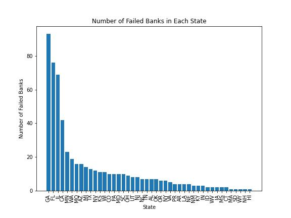
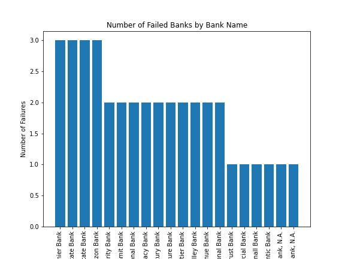
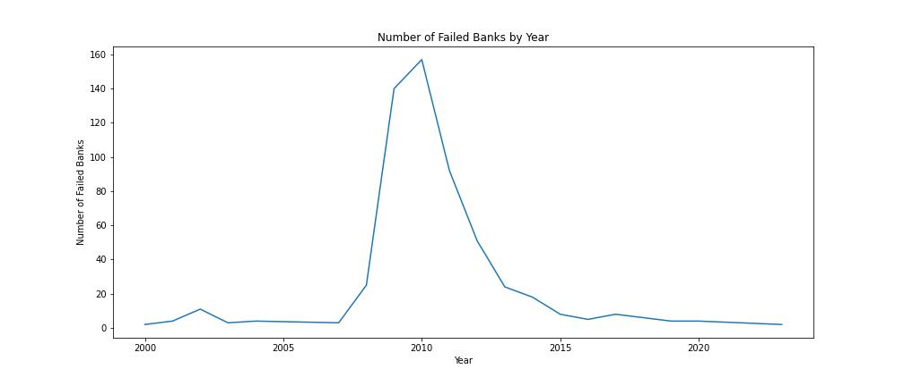
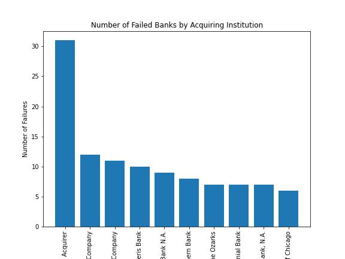

# Failed Banks

This repository contains a powerful Streamlit dashboard that allows users to dive deep into the data on failed banks in the United States. With data from the Federal Deposit Insurance Corporation (FDIC) on banks that have failed since 2000, users can explore patterns by state, bank name, year, and acquiring institution.

This dashboard is an invaluable tool for researchers, policymakers, financial analysts, and anyone else interested in gaining insights into the trends and patterns of bank failures over time. It uses Python and popular libraries such as pandas, matplotlib, seaborn, and Streamlit to provide an interactive experience that allows users to filter and sort the data to gain deeper insights into the trends and patterns of bank failures over time.

By running the dashboard locally on your machine, you can access a range of interactive visualizations that highlight trends and patterns in the data. From state counts to bank counts, year counts to acquiring institution counts, the dashboard provides a wealth of information to explore and analyze.

So, whether you're a researcher trying to understand the causes of bank failures, a policymaker looking to develop regulations to prevent future failures, or a financial analyst trying to gain insights into the industry, this dashboard is the perfect tool for exploring the data on failed banks in the United States.

---

Deployed Streamlit App:
https://failedbanks.streamlit.app/

---

## Installation
To install the required packages, clone this repository and run the following command in your terminal:

    pip install -r requirements.txt

---

## Usage
Run the following command in a terminal to launch the Streamlit app:

    streamlit run FailedBanks.py

The app will open in a new browser window.

---

## Data
The app loads data from the FDIC's bank failure data. The data is available on the FDIC's website and is updated regularly. The app loads the data from the following URL: https://www.fdic.gov/bank/individual/failed/banklist.csv.

---

## Analysis
The app provides the following options for analyzing the failed banks:

- State Counts: This visualization shows the number of failed banks in each state. It helps to identify the states that have experienced the most bank failures.

- Bank Counts: This visualization shows the number of times each bank failed. It helps to identify the banks that have had the most failures.

- Year Counts: This visualization shows the number of failed banks in each year. It helps to identify the years in which the most bank failures occurred.

- Acquiring Institution Counts: This visualization shows the number of failed banks acquired by each institution. It helps to identify the acquiring institutions that have taken over failed banks.

---

## Technologies Used
    Python
    Pandas
    Matplotlib
    Seaborn
    Streamlit
